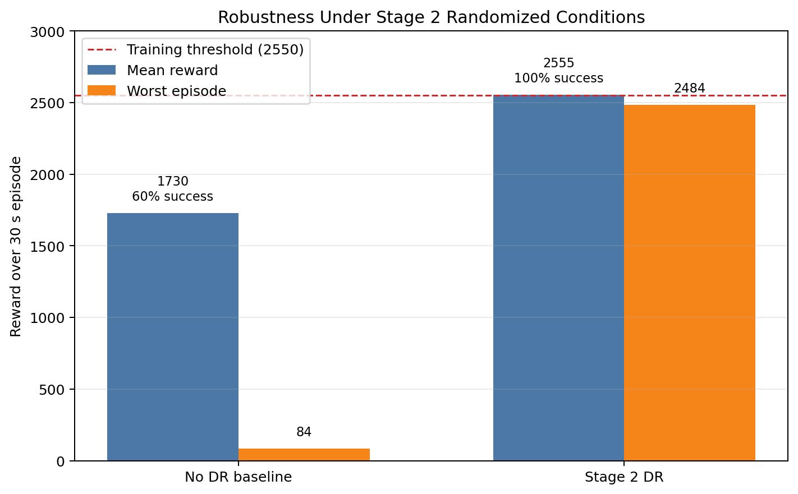

# Furuta Pendulum DR Status Report - June 4, 2026

## Summary

The clean no-DR policy solves the nominal MuJoCo task, but it is not robust to realistic sim-to-real perturbations. The Stage 2 DR policy has lower peak nominal performance, but it is much more reliable under randomized conditions that include small elbow friction, sensor noise, motor variation, delay, and encoder zero offsets.

## Current Model

- CAD: `arm_2.STL`, `rod_2.STL`
- Elbow convention: `qpos[1] = 0` upright, `qpos[1] = +/-pi` hanging
- Rod mass: `0.01888 kg`
- Pivot-to-COM distance: `0.03603 m`
- Control period: `10 ms`
- Episode length: `30 s`
- Maximum reward: `3000`

## Stage 2 DR Profile

Stage 2 includes:

- mass/inertia: `+/-5%`
- shoulder damping: `+/-5%`
- elbow damping: `0 to 0.00002 N*m*s/rad`
- motor torque/gear: `+/-5%`
- action delay: `0 to 1 step`
- shoulder position noise
- shoulder velocity noise
- small elbow position noise
- shoulder encoder zero offset: `+/-1 deg`
- elbow encoder zero offset: `+/-0.5 deg`

Stage 2 excludes:

- elbow velocity filtering

Filtering is excluded because previous tests showed that velocity-filter lag reduced robustness, especially with a broad filter range.

## Robustness Comparison

Both policies were evaluated under the same `real_ready_stage2` randomized environment for 20 episodes.



| Policy | Mean Reward | Std | Worst Episode | Best Episode | Success Rate |
|---|---:|---:|---:|---:|---:|
| No DR baseline | 1729.64 | 1336.33 | 84.20 | 2893.91 | 60% |
| Stage 2 DR | 2554.67 | 43.38 | 2483.71 | 2638.26 | 100% |

Success criterion: episode spends more than 20 s within +/-10 deg of upright during the 30 s rollout.

## Efficiency Metrics

These are measured during the same randomized evaluation.

| Policy | Swing-Up Time | Action RMS | Control Energy | Shoulder Range |
|---|---:|---:|---:|---:|
| No DR baseline | 0.96 s | 0.347 | 5.07 | 136.1 deg |
| Stage 2 DR | 1.02 s | 0.372 | 4.18 | 271.7 deg |

Interpretation:

- No DR swings up slightly faster, but it has catastrophic failures under randomized conditions.
- Stage 2 uses a little more average action, but lower total control energy in this evaluation and much better robustness.
- Stage 2 moves the shoulder through a larger range, which is likely part of its robust recovery strategy.

## Key Finding

The main improvement from Stage 2 is worst-case consistency:

```text
No DR worst episode:      84.20
Stage 2 worst episode:  2483.71
```

This supports the sim-to-real direction: the robot should not be judged only by clean nominal reward. Robustness under realistic perturbations is the more important metric before hardware transfer.

## Next Steps

- Generate a Stage 2 disturbance-recovery test: elbow angle kick and elbow velocity kick after balance.
- Measure real elbow free-swing decay to identify pivot friction.
- Measure AS5600 velocity-estimator lag before adding velocity filtering to DR.
- Later, add board tilt/external disturbance DR for the CyberRunner-style moving-board task.
